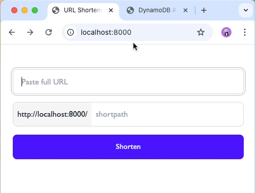
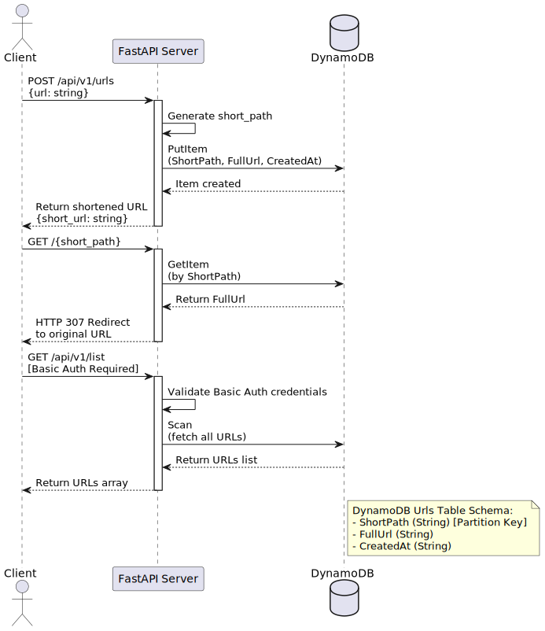

# FastAPI URL Shortener
[LIVE Demo](https://shortenurl.fly.dev/)
___


## Stack
- Python 3.11+
- FastAPI
- Poetry
- Docker
- DynamoDB (DDB)




## Backend development
1. Clone the repository:
    ```shell
    git clone git@github.com:peacefulseeker/fastapi-url-shortener.git ./local-project-dir
    cd ./local-project-dir
    ```

2. Install dependencies:
    ```shell
    poetry install
    ```

3. Run the dockerized services(local DDB instance and DDB admin) in dev mode:
    ```shell
    docker-compose up -d --build
    ```
    1. Run the fastapi app in dev mode:
    ```shell
    make dev

## Frontend development
```shell
cd ./frontend
pnpm install
pnpm dev # proxies API calls to locally running backend (http://localhost:8000 atm.)
```


## PlantUML schema generation(VSCode specific)
- Install [PlantUML](https://marketplace.visualstudio.com/items?itemName=jebbs.plantuml) extension
- Add the following to your settings.json
```json
{
    ...
    "plantuml.exportOutDir": ".",
    "plantuml.exportSubFolder": false,
    ...
}
```
- open `./demo/schema.puml` and run the command `PlantUML: Export Current Diagram`
