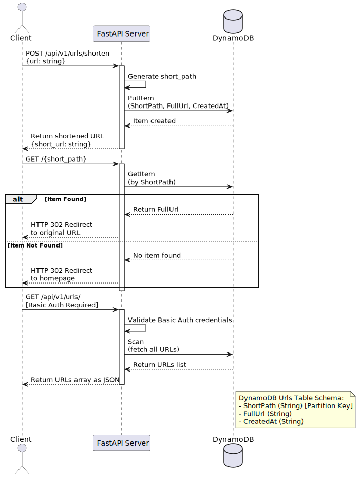

# FastAPI URL Shortener
[LIVE Demo](https://shortenurl.fly.dev/)
___


## Stack
- Python 3.11+
- FastAPI
- Poetry
- Docker
- DynamoDB (DDB)




## Backend development locally
1. Clone the repository:
```shell
git clone git@github.com:peacefulseeker/fastapi-url-shortener.git ./local-project-dir
cd ./local-project-dir
```

2. Install dependencies:
```shell
poetry install
```

4. Run the dockerized services(backend app, local DDB instance and DDB admin) in dev mode:
```shell
docker-compose up -d --build
```

5. OR run the dockerized DDB database, and web app(depends on DDB) locally:
```shell
docker-compose up -d --build ddb
make dev
```

## Frontend development locally
Given repo is already cloned you're currently in the root directory.
```shell
cd ./frontend
pnpm install
pnpm dev # proxies API calls to dockerized backend (8080 port atm.)
```
